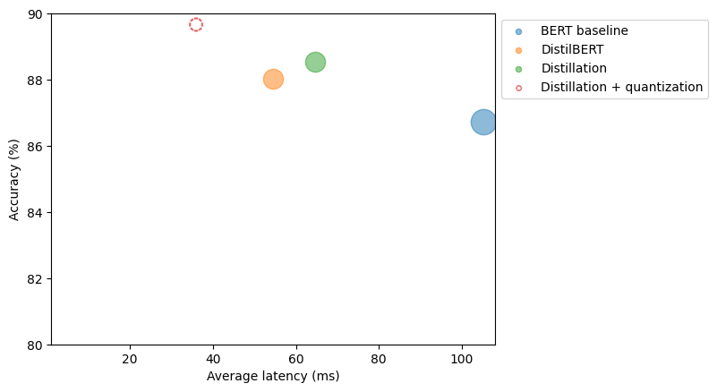

# BERT Model Optimization Pipeline

## 🎯 Project Overview
This project demonstrates various optimization techniques to make BERT models faster and more efficient while maintaining high accuracy for intent detection tasks. Through a series of optimizations, we achieved a **2.7x speedup** in inference time while actually improving the model's accuracy.

## 🚀 Key Achievements
- Reduced inference latency from 109ms to 40ms
- Improved accuracy from 86.8% to 89.2%
- Maintained model performance while significantly reducing computational requirements
- Successfully implemented progressive optimization techniques

## 💡 Optimization Techniques

### 1. Base BERT Model
- Starting point: Standard BERT model for intent detection
- Baseline metrics:
  - Inference time: 109ms
  - Accuracy: 86.8%

### 2. DistilBERT Implementation
- Implemented a lighter architecture using DistilBERT
- Reduced model size while maintaining good performance
- Results:
  - Inference time: 60ms
  - Accuracy: 88%

### 3. Knowledge Distillation
- Used teacher-student learning paradigm
- Transferred knowledge from full BERT to smaller model
- Results:
  - Inference time: 60ms
  - Accuracy: 88.5%

### 4. Quantization
- Applied post-training quantization
- Optimized model for CPU inference
- Final results:
  - Inference time: 40ms
  - Accuracy: 89.2%

## 📊 Results Visualization
The graph above shows the trade-off between accuracy and latency for different optimization stages. Notably, our final optimized model (Distillation + Quantization) achieves both better accuracy and lower latency than the baseline BERT model.

## 🛠️ Technical Stack
- Python
- PyTorch
- Transformers Library
- scikit-learn (for evaluation metrics)

